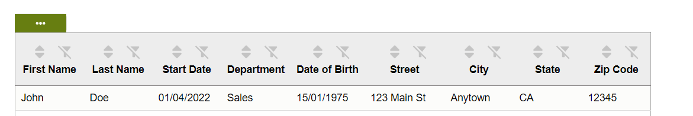

# typescript-table: A package for easily importing a table to display your data .

The Table React component is built with TypeScript and supports various custom data types for easy and flexible usage. It is 100% customizable and accessible.


[](https://github.com/facebook/jest)


This is a React component that displays a table with data. It also allows the user to sort, to filter (by column and general), to choice number of datas per page, and paging, choice order of columns and change their visibility. The component has several state variables that manage its behavior.

The Table component receives two props: data, an array of objects with the data to display, and columns, an array of objects that define the columns of the table.

## Install the package 
with npm:

    `npm install table-component-library`

or yarn:

    `yarn add table-component-library`

## Import in your application
  `import {Table} from 'typescript-table'`

The Table component is built with TypeScript and supports various custom data types for easy and flexible usage within the data={yourData} parameter. You can use different data types, like strings, numbers, dates, and booleans, together in the data you pass to the component. To ensure type safety and compatibility, define the structure of your data type in your TypeScript code.

The following data types can be used together for data={yourData}:

Strings: to represent text or alphanumeric characters. The component automatically handles sorting for various date types displayed as strings.
Numbers: to represent numeric values, including integers and floating-point numbers.
Dates: to represent dates and times, using the JavaScript Date object.
Booleans: to represent logical true or false values.

Use the component like this:
  `<Table data={yourData} columns={yourDataColumns} />`

Customize your component and tailor it to your specific needs by providing the appropriate data types for data={yourData}.

## Exemple of use
****************************************************************************************************************

```diff	
@@ Example: Table of employees @@
```


****************************************************************************************************************

## Exemple data
```js
For columns, labels and properties are required: a label must be assigned to each property of the data array that is to be displayed in a column. If no label is assigned to a property of the data array, that property will be ignored and will not generate a column. The label will be used to name each column in the table, based on each property; the property is the column data from the data array used to retrieve the various column entries.
"The choice of locations for labels and properties in columns allows you to choose the placement of different columns in relation to each other."

To use this package, you can use the following sample data.
<Table data={datasExample} columns={columnsExample} />
with :
const columnsExample = [
    { label: 'First Name', property: 'firstName' },
    { label: 'Last Name', property: 'lastName' },
    { label: 'Start Date', property: 'startDate' },
    { label: 'Department', property: 'department' },
    { label: 'Date of Birth', property: 'dateOfBirth' },
    { label: 'Street', property: 'street' },
    { label: 'City', property: 'city' },
    { label: 'State', property: 'state' },
    { label: 'Zip Code', property: 'zipCode' },
  ];

const datasExample = [
  {
    firstName: 'John',
    lastName: 'Doe',
    dateOfBirth: '15/01/1975',
    startDate: '01/04/2022',
    department: 'Sales',
    street: '123 Main St',
    city: 'Anytown',
    state: 'CA',
    zipCode: '12345',
  },
  {
    firstName: 'Jane',
    lastName: 'Smith',
    dateOfBirth: '17/05/1985',
    startDate: '25/02/2020',
    department: 'Marketing',
    street: '456 Oak St',
    city: 'Othertown',
    state: 'NY',
    zipCode: '67890',
  },
  {
    firstName: 'Bob',
    lastName: 'Johnson',
    dateOfBirth: '30/09/1978',
    startDate: '03/05/2019',
    department: 'IT',
    street: '789 Maple Ave',
    city: 'Somewhere',
    state: 'TX',
    zipCode: '54321',
  }
]
```
## Customize the component's style
To customize the style of the component, you can increase the specificity of your CSS rules. This means that you can target the component more precisely by adding more specific selectors to your CSS rules.

For example, to change the background color of the th of the table, you can use the following CSS rule (with for example .box_table):
change for example:

`.thColor{
  border-bottom: 1px solid #1b1818;
  background-color: #b1c46c;
}`

to

`.box_table .thColor{
  border-bottom: 1px solid #1b1818;
  background-color: blue;
}`

or change the background-color of reset all search button:
change for example

  `.btn_Reset{
  background-color: #677e11;
  }
  .btn_Reset:hover{
    background-color: #7e9b16;
  };`

to:

  `.box_table .btn_Reset{
  background-color: #86c1e6;
  }
  .box_table .btn_Reset:hover{
    background-color: #1e92db;
  };`

or if you want change the header of table :
like this 


add in your css :

 `.box_labelAndBtnsColumn{
  flex-direction: column-reverse;
};`
 
## Remove features :

-Remove search global

  `.box_table .box_searchReset{
    display:none;
  }`

-Remove choice of the number of entries per page:

  `.box_table .box_ChoiceEntries{
    display:none;
  }`

-Remove sort the entries:

  `.box_table .btnSort{
      display:none;
  }`

-Remove search per column:

  `.box_table .btnFilter{
      display:none;
  }`


## Sponsor the project
If you find this package useful or if you want to do a kind and generous act, you can ❤️  [sponsoring my work](https://github.com/sponsors/palacioscaroline) . Your sponsorship will help me dedicate more time to maintaining the project and will encourage me to create new projects and continue my studies. If you're a company using typescript-table in a commercial project, you can also hire my services.

## Hiring the author
If you want to hire my services, don’t hesitate to drop me a line at the email address listed in my GitHub profile.

#### License

This project is licensed under the MIT License - see the [LICENSE]((https://github.com/palacioscaroline/typescript-table/blob/master/LICENSE).) file for details.


