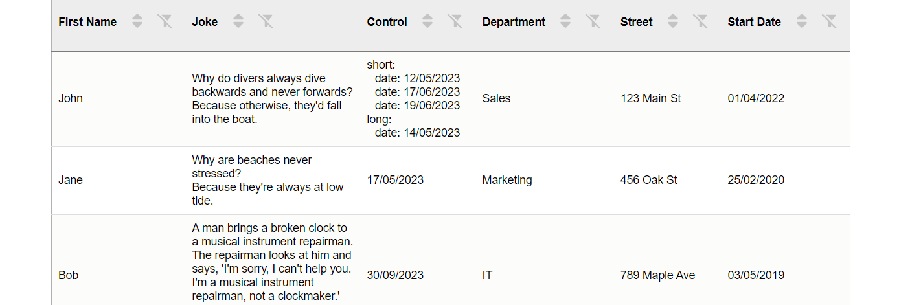

# typescript-table: A package for easily importing a table to display your data .

The Table React component is built with TypeScript and supports various custom data types for easy and flexible usage. It is 100% customizable and accessible, and responsive.


[](https://github.com/facebook/jest)


This is a React component that displays a table with data. The component has several state variables that manage its behavior.
The Table component receives two props: data, an array of objects with the data to display, and columns, an array of objects that define the columns of the table.

# Features

  - Sorting
  - filter (global and column-specific)
  - Pagination
  - columns : visibility and order
  - column to select rows
  - export data to csv, excel and pdf (with import 'exportDataComponent')
  - Customizable
  - Accessible (focus, tabulation and aria-label)
  - Responsive (via x-scroll/flex)

## Install the package 
with npm:

    `npm install typescript-table`

or yarn:

    `yarn add typescript-table`

## Import in your application

  `import {Table} from 'typescript-table'`

The Table component is built with TypeScript and supports various custom data types for easy and flexible usage within the data={yourData} parameter. You can use different data types, like strings, numbers, dates, and booleans, together in the data you pass to the component. To ensure type safety and compatibility, define the structure of your data type in your TypeScript code.

The following data types can be used together for data={yourData}:

Use the component like this:

  `<Table data={yourData} columns={yourDataColumns} />`

Customize your component and tailor it to your specific needs by providing the appropriate data types for data={yourData}.

## All data types can be displayed in the table:

The table displays all different types of data:

String: for dates given as strings, sorting is done based on the dateFormat property passed in the columns prop to the relevant column.
Number
Boolean
Date: displayed in the table as value.toLocaleDateString()
Object: processed recursively up to a depth of 4
Array: processed recursively up to a depth of 4

## Exemple of use
****************************************************************************************************************

```diff	
@@ Example: Table of employees @@
```




****************************************************************************************************************

## else use with boutons to export data: 
Use Table with a ExportDataComponent.


Install before using buttons's functionality.

  `npm install file-saver xlsx jspdf jspdf-autotable`

after

  ```js
    import {Table} from 'typescript-table'
    import {ExportDataComponent} from 'typescript-exportdata'

    <Table
      data={datasExample}
      columns={columnsExample}
      renderExportDataComponent={(filteredData,columnsManaged) => (
        <ExportDataComponent
          filteredData={filteredData} //don't change this
          columnsManaged={columnsManaged}  //don't change this
          headerProperty='label' //don't change this
          csvExport={true} // to have an export bouton for csv format
          excelExport={true} // to have an export bouton for excel format
          pdfExport={true} // to have an export bouton for pdf format
        />
      )}
    />
  ```

you can choice to display just one bouton to export, exemple with the pdf button :


  ```
    <Table
      data={datasExample}
      columns={columnsExample}
      renderExportDataComponent={(filteredData, columnsManaged) => (
        <ExportDataComponent
          filteredData={filteredData} // don't change this props
          columnsManaged={columnsManaged} // don't change this props
          headerProperty='label' //don't change this props
          pdfExport={true} // just this
        />
      )}
    />
  ```

- Without the data export button.


## "Customizing Sorting and Filtering."
"Sorting and filtering are implemented by default for each column in the table. However, if you want to remove these features for a specific column, you simply need to add the property disableSort: true to disable sorting, or disableFilter: true to disable filtering, in the object of the respective column."
- example for a column :
```js
{
  label: 'First Name',	
  property: 'firstName',
  disableSort: true, // for disable sorting
  disableFilter: true // for disable filtering
}
```
## Example datas

For columns, labels and properties are required: a label must be assigned to each property of the data array that is to be displayed in a column. If no label is assigned to a property of the data array, that property will be ignored and will not generate a column. The label will be used to name each column in the table, based on each property; the property is the column data from the data array used to retrieve the various column entries.
"The choice of locations for labels and properties in columns allows you to choose the placement of different columns in relation to each other."

To use this package, you can use the examples like the data in the following example.
<Table data={datasExample} columns={columnsExample} />
with :

```js
const columnsExample: Column[] = [
    { label: 'First Name', property: 'firstName', disableSort:true, disableFilter:true },
    { label: 'Last Name', property: 'lastName' },
    { label: 'Start Date', property: 'startDate' },
    { label: 'Department', property: 'department' },
    { label: 'Date of Birth', property: 'dateOfBirth',dateFormat: 'DD/MM/YYYY',   disableSort:true, disableFilter:true },
    { label: 'Street', property: 'street', disableSort:true, disableFilter:true},
    { label: 'City', property: 'city' },
    { label: 'State', property: 'state', disableSort:true },
    { label: 'Zip Code', property: 'zipCode', disableSort:true },
];

const datasExample = [
  {
    id: 1,
    firstName: 'John',
    lastName: 'Doe',
    dateOfBirth: '15/01/1975',
    startDate: new Date('01/04/2022'),
    department: 'Sales',
    street: '123 Main St',
    city: 'Anytown',
    state: 'CA',
    zipCode: 12345,
  },
  {
    id: 2,
    firstName: 'Jane',
    lastName: 'Smith',
    dateOfBirth: '17/05/1985',
    startDate: new Date('25/02/2020'),
    department: 'Marketing',
    street: '456 Oak St',
    city: 'Othertown',
    state: 'NY',
    zipCode: 67890,
  },
  {
    id: 3,
    firstName: 'Bob',
    lastName: 'Johnson',
    dateOfBirth: '30/09/1978',
    startDate: new Date('03/05/2019'),
    department: 'IT',
    street: '789 Maple Ave',
    city: 'Somewhere',
    state: 'TX',
    zipCode: 54321,
  }
]
```

## Date format for columns (data as strings containing dates)

When you provide data as strings containing dates, you need to specify the date format to use for each column containing a date in string format is essential to optimize the sorting functionality. You can do this by adding the dateFormat attribute to the corresponding column definition.

The date format should be specified using the characters 'DD', 'MM', and 'YYYY' to represent the day, month, and year, respectively. For example:

- For a date string 'DD/MM/YYYY', 'DD-MM-YYYY', or 'DD.MM.YYYY', use:

`dateFormat: 'DD/MM/YYYY'`

 - For a date string 'MM/DD/YYYY', 'MM-DD-YYYY', or 'MM.DD.YYYY', use:

 `dateFormat: 'MM/DD/YYYY'`

 - For a date string 'YYYY/MM/DD', 'YYYY-MM-DD', or 'YYYY.MM.DD', use:

  `dateFormat: 'YYYY/MM/DD'`

The accepted and automatically managed separators are '/', '-', and '.'.
Here's how to specify the date format for a column:

```javascript
{
  label: 'Date of Birth',	
  property: 'dateOfBirth',
  dateFormat: 'DD/MM/YYYY' // Use this value for formats 'DD/MM/YYYY', 'DD-MM-YYYY' or 'DD.MM.YYYY'
}
```

By adding the dateFormat attribute to the column definition, the Table component will know how to correctly process the dates provided as strings.

## Customize the style'component

The default style :
  background = '#677e11',
  color = 'white',
  hoverBackground = '#7e9b16',
  selectedRowsBackground = 'rgba(175 228 145 / 20%)'

```javascript
 <Table
        data={datasExample}
        columns={columnsExample}
        background='red' //change background button and dropdown
        color='#fff' //change color button and dropdown
        hoverBackground='salmon' //change background :hover button and dropdown
        selectedRowsBackground='#ffdcd8' //change background selected rows
  />
```


To customize the style of the component, you can increase the specificity of your CSS rules. This means that you can target the component more precisely by adding more specific selectors to your CSS rules.

For example, to change the background color of the th of the table, you can use the following CSS rule (with for example .box_table):
change for example:


```css
.thColor{
  border-bottom: 1px solid #1b1818;
  background-color: #b1c46c;
}
```

to

```css
.box_table .thColor{
  border-bottom: 1px solid #1b1818;
  background-color: blue;
}
```

or if you want change the header of table :
like this 


add in your css :

```css
.box_labelAndBtnsColumn{
  flex-direction: column-reverse;
}
```

## Remove features :

-Remove search global
```css
.box_table .box_searchReset{
    display:none;
}
```

-Remove choice of the number of entries per page:
```css
.box_table .box_ChoiceEntries{
    display:none;
}
```

-Remove sort the entries:
```css
.box_table .btnSort{
  display:none;
}
```

-Remove search per column:
```css
.box_table .btnFilter{
  display:none;
}
```

## Hiring the author
If you want to hire my services, don’t hesitate to drop me a line at the email address listed in my GitHub profile.

#### License

This project is licensed under the MIT License - see the [LICENSE]((https://github.com/palacioscaroline/typescript-table/blob/master/LICENSE).) file for details.


